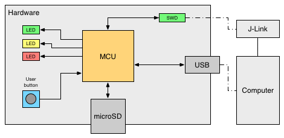
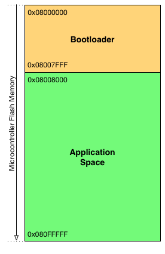
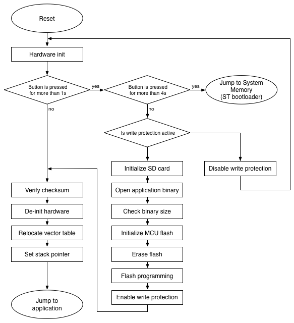

# STM32 Bootloader
Customizable Bootloader for STM32 microcontrollers. This example demonstrates how to perform in-application-programming of a firmware located on external SD card with FAT32 file system.

## Table of Contents
- [Bootloader features](#bootloader-features)
- [Description](#description)
- [Source code organization](#source-code-organization)
- [How to use](#how-to-use)
- [Configuration](#configuration)
- [References](#references)

## Bootloader features
- Configurable application space
- Flash erase
- Flash programming
- Flash verification after programming
- Checksum verification
- Flash protection check, write protection enable/disable
- Extended error handling, fail-safe design
- Bootloader firmware update and the ability to perform full chip re-programming: enter ST's built-in bootloader from software (without triggering the BOOT pin)
- SWO tracing for easier debugging and development
- Easy to customize and port to other microcontrollers

## Description
This demo is implemented on a custom hardware (see Figure 1) equipped with a STM32L496VG microcontroller [[1, 2]](#references). The microSD card is connected to the MCU over SDIO interface. The implementation uses the official HAL library of ST [[4]](#references) and is compiled with IAR EWARM. Programming and debugging is performed over SWD with a SEGGER J-Link debug probe.

**Note:** The bootloader currently supports the STM32L496VG and STM32L476VG microcontrollers [[1, 3]](#references) out-of-the-box. The individual build configurations for different microcontrollers can be selected with a single click in IAR. Release v1.03 introduced support for the STM32L496VG microcontroller. Earlier versions support the STM32L476VG microcontroller only. For complete list of changes, please see the [CHANGELOG](CHANGELOG.md) file.



*Figure 1: System overview*

The microcontroller flash is organized as follows: by default the first 32kBytes (16 pages) of the flash is reserved for the bootloader and the rest of the flash is the application space. 



*Figure 2: Flash organization*

After power-up, the bootloader starts. All three LEDs are flashed for a second, then the bootloader checks for user-interaction:

- If the button is not pressed, then the bootloader tries to launch the application: First it checks the application space. If there is a firmware located in the application space, the bootloader calculates the checksum over the application space and compares with the application checksum (if the checksum feature is enabled). Finally, the bootloader prepares for the jump by resetting the peripherals, disabling the SysTick, setting the vector table and stack pointer, then the bootloader performs a jump to the application.

- If the button is pressed and released within 4 seconds: the bootloader tries to update the application firmware by performing the following sequence:

    1. Checks for write protection. If the application space is write-protected, then the red LED is switched on and the yellow LED is flashed for five seconds. If the button is pressed within this interval, the bootloader disables the write protection by re-programming the flash option bytes and performs a system reset (required after flash option bytes programming). Please note that after disabling the write protection, the user has to invoke the application update procedure again by pressing the button in order to continue the firmware update.
    2. Initializes SD card, looks for application binary and opens the file.
    3. Checks the file size whether it fits the application space in the microcontroller flash.
    4. Initializes microcontroller flash.
    5. Erases the application space. During erase, the yellow LED is on. If the user presses the button and keeps it pressed until the end of the flash erase procedure, the bootloader then interrupts the firmware update and does not perform flash programming after the erase operation. This feature is useful if the user only wants to erase the application space.
    6. Performs flash programming. During flashing, the green LED is blinking.
    7. Verifies flash programming by re-opening the firmware file located on the SD card and comparing the content of the file with the flash content.
    8. Enables write protection of application space if this feature is enabled in the configuration.
    9. After successful in-application-programming, the bootloader launches the application.

- If the button is pressed for more than 4 seconds: the bootloader launches ST's built-in bootloader located in the internal boot ROM (system memory) of the chip. For more information, please refer to [[5]](#references). With this method, the bootloader can be updated or even a full chip re-programming can be performed easily, for instance by connecting the hardware to the computer via USB and using DFU mode [[6, 7]](#references).

- If the button is kept pressed for more than 9 seconds: the bootloader tries to launch the application located in the flash. This scenario is fully equivalent to the case when the user does not press the button after power-up (see above).



*Figure 3: Bootloader sequence*

## Source code organization
```
stm32-bootloader/
  |—— Drivers/
  |—— EWARM/
  |—— Inc/
  |—— Middlewares/
  `—— Src/
```
`Drivers` and `Middlewares` folders contain the CMSIS, HAL and FatFs libraries. The bootloader source code and corresponding header files can be found in `Src` and `Inc` folders respectively.

## How to use
The bootloader can be easily customized and tailored to the required hardware and environment, i.e. to perform firmware updates over various interfaces or even to implement over-the-air (OTA) updates if the hardware incorporates wireless communication modules. In order to perform successful in-application-programming, the following sequence has to be kept:
1. Check for flash write protection and disable it if necessary.
2. Initialize flash with `Bootloader_Init()`.
3. Erase application space with `Bootloader_Erase()` (optional, but recommended).
4. Prepare for programming by calling `Bootloader_FlashBegin()`.
5. Perform programming by repeatedly calling the `Bootloader_FlashNext(uint64_t data)` function. The programming procedure requires 8 bytes of data (double word) to be programmed at once into the flash. This function automatically increases the address where the data is being written.
6. Finalize programming by calling `Bootloader_FlashEnd()`.

The application image has to be in binary format. If the checksum verification is enabled, the binary must include the checksum value at the end of the image. When creating the application image, the checksum has to be calculated over the entire image (except the checksum area) with the following parameters:
- Algorithm: CRC32
- Size: 4 bytes
- Initial value: 0xFFFFFFFF
- Bit order: MSB first

__Important notice__: in order to perform a successful application jump from the bootloader, the vector table of the application firmware should be relocated. On system reset, the vector table is fixed at address 0x00000000. When creating an application, the microcontroller startup code sets the vector table offset to 0x0000 in the `system_stm32xxxx.c` file by default. This has to be either disabled (the bootloader can be configured to perform the vector table relocation before the jump) or manually set the the vector table offset register (VTOR) to the appropriate offset value which is the start address of the application space. For more information, please refer to [[8]](#references).

## Configuration
The bootloader can be widely configured in the `bootloader.h` file. The file includes detailed comments and descriptions related to the configurable parameters and definitions.

## References
[1] STM32L496VG, http://www.st.com/en/microcontrollers/stm32l496vg.html

[2] RM0351, “STM32L4x5 and STM32L4x6 advanced ARM®-based 32-bit MCUs Reference Manual”, http://www.st.com/resource/en/reference_manual/dm00083560.pdf

[3] STM32L476VG, http://www.st.com/en/microcontrollers/stm32l476vg.html

[4] UM1884, “Description of STM32L4 HAL and Low Layer drivers”, http://www.st.com/resource/en/user_manual/dm00173145.pdf

[5] AN2606, "STM32 microcontroller system memory boot mode", http://www.st.com/resource/en/application_note/cd00167594.pdf

[6] AN3156, "USB DFU protocol used in the STM32 bootloader", http://www.st.com/resource/en/application_note/cd00264379.pdf

[7] UM0412, "Getting started with DfuSe USB device firmware upgrade", http://www.st.com/resource/en/user_manual/cd00155676.pdf

[8] PM0214, "STM32F3 Series, STM32F4 Series, STM32L4 Series and STM32L4+ Series Cortex®-M4 Programming Manual", http://www.st.com/resource/en/programming_manual/dm00046982.pdf
