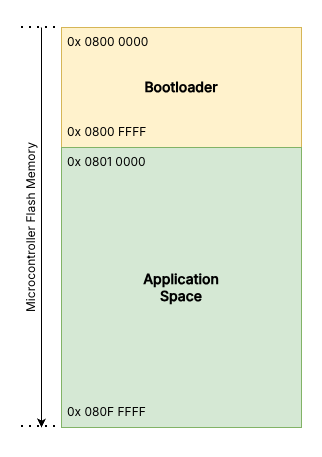
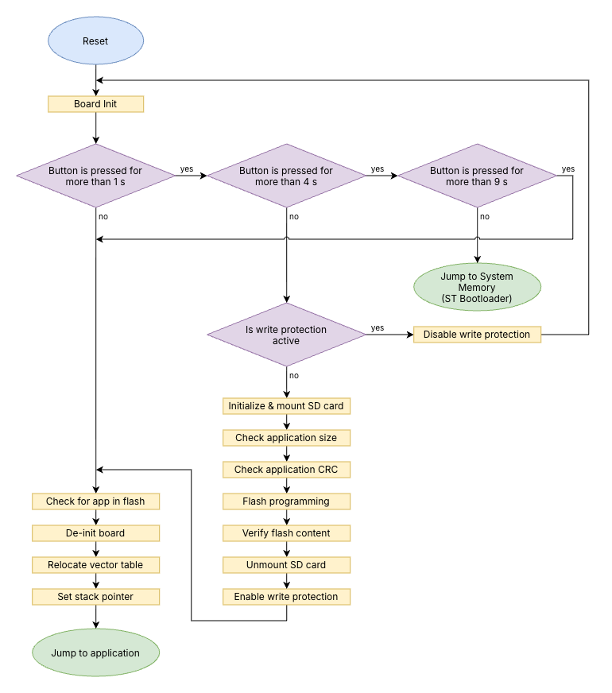

# STM32 Bootloader

Customizable Bootloader for STM32 microcontrollers. This project includes a
demonstration for the STM32L496-Discovery board how to perform
in-application-programming of a firmware located on external SD card with FAT32
file system.

**Update:** After almost 10 years, I've decided to give a proper refactor for
this project. With the v2.0.0 release the project adopted a modern, modular and
scalable project structure based on the
[stm32-project-template](https://github.com/akospasztor/stm32-project-template).
The build system is CMake-based, while the legacy Make & SCons-based build
systems are still available with limited functionality. The bootloader
demonstration is refactored: the source code is fully MISRA-conform and passes
clang-tidy and cppcheck static code analysis checks. Check out the
[CHANGELOG.md](CHANGELOG.md) for the complete list of changes!

The source code of the entire bootloader project is documented and commented
thoroughly. The generated documentation page is published here:
<https://akospasztor.github.io/stm32-bootloader>

[](https://github.com/akospasztor/stm32-bootloader/actions/workflows/ci-pipeline.yml)

## Contents

- [Contents](#contents)
- [Bootloader features](#bootloader-features)
- [Hardware setup](#hardware-setup)
- [How to use](#how-to-use)
  - [Prerequisites](#prerequisites)
  - [CRC calculation](#crc-calculation)
  - [Quick start guide](#quick-start-guide)
- [Build and debug](#build-and-debug)
  - [Prerequisites](#prerequisites-1)
  - [Build with CMake](#build-with-cmake)
  - [Build with Make](#build-with-make)
  - [Build with SCons](#build-with-scons)
  - [Debug](#debug)
- [Detailed operation](#detailed-operation)
- [Configuration](#configuration)
- [Source code organization](#source-code-organization)
- [References](#references)

## Bootloader features

- Configurable application space; flash layout & addresses are taken from the
  linker script automatically
- Flash erase, programming and verification after programming
- Flash protection check, write protection enable/disable
- CRC verification
- Extended error handling, fail-safe design
- Bootloader firmware update and the ability to perform full chip
  re-programming: enter ST's built-in bootloader from software (without
  triggering the BOOT pin)
- CMake-based build system
- Platform-independent development environment via devcontainer support
- Well-abstracted project hierarchy, with dedicated BSP layer
- Easy to customize and port to other microcontrollers

## Hardware setup

This demo is implemented on the 32L496GDISCOVERY board from ST
[[1]](#references), equipped with a STM32L496AG microcontroller
[[2]](#references). Please refer to the user manual of the discovery board for
the complete schematics and board description [[3]](#references).

The microSD card is connected to the MCU over SDIO interface. The implementation
uses the official HAL library of ST [[4]](#references) and can be compiled with
the GNU Arm Embedded Toolchain. Programming and debugging are performed over the
on-board ST-LINK debugger.

There are two LEDs located on the discovery board, which are easily accessible,
and they don't require the use of the IO expander. These LEDs are used for
signaling various status to the user and they are labeled as `LD2` and `LD3`.

The middle (center) button of the blue joystick (`B2`) located on the discovery
board is used for user interaction. This center button is simply referred as
"button" in the following sections.

The UART2 interface of the MCU is connected directly to the ST-LINK on the
board. When the ST-LINK is connected to the computer via USB, an additional
virtual com port (USB VCP) is initialized by the debugger. The assigned COM port
number can be checked in the Device Manager on Windows. This example project
uses this virtual com port to output various debug messages.

A compiled application image named `app-demo.bin` in the `test` folder is
provided with this example project. This file can be copied directly to the SD
card of the discovery board and it can be used for testing the functionality of
the bootloader.

The microcontroller flash is organized as follows: by default, the first 64
kBytes (32 pages) of the flash is reserved for the bootloader and the rest of
the flash is the application space.

\
_Figure 1: Flash organization_

## How to use

The bootloader can be easily customized and tailored to the required hardware
and environment, i.e. to perform firmware updates over various interfaces or
even to implement over-the-air (OTA) updates if the hardware incorporates
wireless communication modules.

### Prerequisites

The application image has to be in binary format. The CRC verification requires
a file (named `app-demo.crc` by default) to be present on the SD card alongside
of the application binary, containing the CRC value of the application.

If the checksum verification is enabled, the binary must include the checksum
value at the end of the image. When creating the application image, the checksum
has to be calculated over the entire image (except the checksum area) with the
following parameters:

### CRC calculation

The CRC can be calculated with the following parameters:

- Algorithm: CRC32
- Width: 4 bytes (32 bits)
- Polynomial: 0x04C11DB7
- Initial value: 0xFFFFFFFF

**Tip:** Use the following website to quickly calculate the CRC of a binary
file, with the settings specified below:
<https://emn178.github.io/online-tools/crc/>

| Setting       | Value               |
| ------------- | ------------------- |
| Input type    | File                |
| Model         | Custom              |
| Width         | 32 bit              |
| Polynomial    | `04C11DB7`          |
| Initial value | `FFFFFFFF`          |
| XOR out       | `FFFFFFFF`          |
| Refin         | Disable (Unchecked) |
| Refout        | Disable (Unchecked) |

**Note:** Alternatively, `CRC-32/MPEG-2` preset model can be selected as this
CRC model corresponds to the required CRC settings.

### Quick start guide

Follow these steps to carry out a firmware update provided by this project:

1. Prepare the SD card and copy the `app-demo.bin` located in the `test` folder
   onto the SD card.
2. Create a new file titled `app-demo.crc` containing the CRC value (in hex
   format, without the `0x` prefix) of the application image. Note:
   Alternatively, the `app-demo.crc` file located in the `test` folder can also
   be simply copied over to the SD card as it already contains the CRC value of
   the `app-demo.bin` file.
3. Build the bootloader project (see the [Build and debug](#build-and-debug)
   section).
4. Attach an USB cable to the `CN5` port (located on the shorter side of the
   board), perform a mass erase and flash the bootloader firmware to the
   STM32L496-Discovery board.
5. Keep the USB cable connected, open a serial monitor tool and observe the
   output logs:

   ```
   --------------------------------------------
   Power up, Boot started
   Bootloader version: 2.0.0
   Application area: 0x8010000-0x8100000
   --------------------------------------------
   Error: No application in flash
   ```

6. Press and keep holding the center button of the joystick (`B2`), then reset
   the board by pressing the `B1` button. Keep holding the joystick button until
   the following log is displayed: `Release button now to update the
   firmware...`
7. The firmware update procedure starts and after a successful update, the new
   application image is automatically started. Observe the output logs:

   ```
   --------------------------------------------
   Power up, Boot started
   Bootloader version: 2.0.0
   Application area: 0x8010000-0x8100000
   --------------------------------------------
   Release button now to update the firmware...
   Starting the firmware update process...
   Size of application on the SD card: 15648 bytes
   CRC matches. CRC value: 0xfccdb7d2
   Starting programming...
   Programming successful. Flashed: 15648 bytes
   Starting verification...
   Verification successful. Verified: 15648 bytes
   Launching application...
   Starting application v1.0 ...
   ***
   ```

**Important notes:**

- In order to perform a successful application jump from the bootloader, the
  vector table of the application firmware should be relocated. On system reset,
  the vector table is fixed at address 0x00000000. When creating an application,
  the microcontroller startup code sets the vector table offset to 0x0000 in the
  `system_stm32l4xx.c` file by default. This has to be either disabled (the
  bootloader can be configured to perform the vector table relocation before the
  jump) or manually set the vector table offset register (VTOR) to the
  appropriate offset value which is the start address of the application space.
  For more information, please refer to [[5]](#references).
- The linker settings of the application firmware need to be adjusted from their
  default settings so that the start address of flash reflects the actual start
  address of the application space.

## Build and debug

The project can be built with the GNU Arm Embedded Toolchain. CMake is used as
the main build system, however the legacy build options with Make and SCons are
still available with limited functionality.

**Note:** As of the `v2.0.0` release, this project is based on the modern
[stm32-project-template](https://github.com/akospasztor/stm32-project-template)
project. Check out its
[README.md](https://github.com/akospasztor/stm32-project-template/blob/master/README.md)
for detailed description of available features, commands, devcontainer & VSCode
integration details, and more.

### Prerequisites

- [CMake](https://cmake.org/download/) is installed and available on your PATH.
- [Cppcheck](https://cppcheck.sourceforge.io/) is installed and available on
  your PATH.
- [Ninja](https://ninja-build.org) is installed and available on your PATH.
  Alternatively, you can also use Make instead of Ninja as the underlying build
  system.
- [GCC for ARM](https://developer.arm.com/downloads/-/gnu-rm) (GNU Arm Embedded
  Toolchain) is installed and available in your PATH. Recommended version:
  `10-2020-q4`.
- Clang-format and clang-tidy tools are installed and available in your PATH.
  These tools are used for source code formatting and performing style checks.
  You can obtain these tools via your preferred package manager or by installing
  the [LLVM](https://llvm.org) toolchain.
- Python is required to run clang-format from the build system. Additionally,
  the `requirements.txt` file contains packages that are used for style checks.
  It is highly recommended to install and run the python packages in a python
  virtual environment (virtualenv).

Note: In case the GCC for ARM or the clang-tools are not available in your PATH
(e.g. you have multiple, different versions installed), you can specify the
toolchain paths in the respective toolchain `.cmake` file.

### Build with CMake

| Command                                           | Description                                               |
| ------------------------------------------------- | --------------------------------------------------------- |
| `cmake --list-presets`                            | List all CMake presets                                    |
| `cmake --preset Debug`                            | Configure the project for Debug build                     |
| `cmake --build build/Debug`                       | Build the firmware with Debug build type                  |
| `cmake --build build/Debug --target clean`        | Clean the Debug target                                    |
| `cmake --build build/Debug --target check-format` | Check source code formatting with clang-format            |
| `cmake --build build/Debug --target run-format`   | Run source code formatting with clang-format              |
| `cmake --build build/Debug --target cppcheck`     | Perform analysis and MISRA conformity check with cppcheck |
| `cmake --build build/Debug --target tidy`         | Perform analysis and style check with clang-tidy          |
| `cmake --build build/Debug --target doxygen`      | Generate documentation with Doxygen                       |

Supported CMake configurations and presets:

| Preset           | Description                                                                        |
| ---------------- | ---------------------------------------------------------------------------------- |
| `Debug`          | Debug preset for debugging, without any optimization enabled                       |
| `Release`        | Release preset with `O3` optimization                                              |
| `MinSizeRel`     | Release preset with `Os` optimization for size with link time optimization enabled |
| `RelWithDebInfo` | Release preset with `O2` optimization with debug information                       |

### Build with Make

Steps to compile and build with GNU Make:

1. If the GNU Arm Embedded Toolchain has not been added to PATH: export the
   `GCC_PATH` environmental variable containing the path to the `bin` folder of
   the installed GNU Arm Embedded Toolchain. The `Makefile` checks for the
   `GCC_PATH` environmental variable before checking PATH.
2. Open up your favorite terminal and navigate to the `GCC` subfolder where the
   makefile is located.
3. Type `make` and hit enter.
4. The `build` subfolder should contain the binary, ELF and HEX output files,
   named `stm32-bootloader.bin`, `stm32-bootloader.elf` and
   `stm32-bootloader.hex` respectively.

### Build with SCons

This project currently supports two build configurations: debug (default) and
release. Follow these steps to compile and build the project with SCons. Please
note that the recommended usage is within a virtualenv.

1. Install the requirements: `pip install -r requirements.txt`. This contains
   SCons (among other helper tools).
2. If the `bin` folder of the GNU Arm Embedded Toolchain does not exist in the
   PATH, it can be specified in the `SConstruct` file.
3. To build the project with the default debug configuration, execute:
   `scons -j8`
4. To build all build configurations at once, execute: `scons --all -j8`
5. To list all supported arguments, execute: `scons --help`
6. The `build` subfolder should contain the generated outputs, organized in
   subfolders with the names of the build configurations.

### Debug

By default, the debug configuration is set up with a SEGGER J-Link debug probe.
SEGGER offers a tool to convert the onboard ST-Link debugger on Discovery and
Nucleo boards into a SEGGER J-Link debugger. The onboard ST-Link debugger on the
STM32L496-Discovery board used in this project was converted to a J-Link
debugger
[with this tool](https://www.segger.com/products/debug-probes/j-link/models/other-j-links/st-link-on-board/).

This project provides debug configurations for VSCode via the Cortex-Debug
extension (see `.vscode/launch.json`) and for SEGGER Ozone (see the Ozone
project file in the `project/ozone` folder).

## Detailed operation

After power-up, the bootloader starts. The bootloader checks for
user-interaction:

- If the button is not pressed, then the bootloader tries to launch the
  application: First it checks the application space. If there is a firmware
  located in the application space, the bootloader calculates the checksum over
  the application space and compares with the application checksum (if the
  checksum feature is enabled). Finally, the bootloader prepares for the jump by
  resetting the peripherals, disabling the SysTick, setting the vector table and
  stack pointer, then the bootloader performs a jump to the application.
- If the button is pressed and released within 4 seconds: LD2 is blinking during
  this interval and the bootloader attempts to update the application firmware
  by performing the following sequence:
  1. Checks for write protection. If the application space is write-protected,
     then both LD2 and L3 LEDs are blinking for five seconds. If the button is
     pressed within this interval, the bootloader disables the write protection
     by re-programming the flash option bytes and performs a system reset
     (required after flash option bytes programming). Please note that after
     disabling the write protection, the user must invoke the application update
     procedure again by pressing the button in order to continue the firmware
     update.
  2. Initializes SD card, looks for application binary and opens the file.
  3. Checks the file size whether it fits the application space in the
     microcontroller flash.
  4. Calculates the CRC of the application binary, then opens the file on the SD
     card containing the CRC value and verifies that the two CRC values match.
  5. Performs flash programming. During flashing the LD2 LED is blinking. Note:
     the MCU flash driver automatically performs the required flash erase
     operations before executing the write operations.
  6. Verifies flash programming by re-opening the firmware file located on the
     SD card and comparing the content of the file with the flash content.
  7. Enables write protection of application space if this feature is enabled in
     the configuration.
  8. After successful in-application-programming, the bootloader launches the
     application.
- If the button is pressed for more than 4 seconds: LD3 is blinking during this
  interval and the bootloader launches ST's built-in bootloader located in the
  internal boot ROM (system memory) of the chip. For more information, please
  refer to [[6]](#references). With this method, the bootloader can be updated
  or even a full chip re-programming can be performed easily, for instance by
  connecting the hardware to the computer via USB and using DFU mode
  [[7, 8]](#references).
- If the button is kept pressed for more than 9 seconds: the LEDs are switched
  off and the bootloader tries to launch the application located in the flash.
  This scenario is fully equivalent to the case when the user does not press the
  button after power-up (see above).

\
_Figure 2: Bootloader sequence_

## Configuration

The bootloader can be configured in the `bootloader.h` file. The file includes
detailed comments and descriptions related to the configurable parameters and
definitions.

## Source code organization

```
stm32-bootloader
├── .devcontainer
├── .github
├── bootloader
│   ├── include
│   └── source
├── bsp
│   └── stm32l496-discovery
│       ├── gcc-arm
│       ├── include
│       ├── source
│       └── svd
├── build
├── cmake
├── docs
├── lib
│   ├── CMSIS
│   ├── FatFs
│   └── STM32L4xx_HAL_Driver
├── lint
├── project
├── script
└── test
```

The `.devcontainer` folder contains the devcontainer file which enables
development inside a container.

The `.github` folder contains the GitHub Actions workflow file which describes
the CI pipeline that runs automatically on every git push operation.

The application-level source code of the bootloader is located in the
`bootloader` folder; organized into source and include subfolders.

The `bsp` folder stands for Board Support Package. This folder contains the
board- and microcontroller-specific files and drivers. These drivers are
interfaced by the application-level source code and they function as tiny
wrappers around the low-level (STM32 HAL) drivers. This allows the application
to interface these thin wrappers instead of the manufacturer-specific low-level
code, thus providing easy portability across different chips and
microcontrollers.

Upon building the project, a `build` folder is created. All build-related files
and output binaries are located in the build folder, organized into subfolders.
Each build target and their respective output files have their own subfolder.
The generated Doxygen documentation output files are also located in the `build`
folder.

The `cmake` folder contains the files related to the CMake-based build system,
including the toolchain and microcontroller-specific files.

The`docs` folder contains the doxygen configuration file (`Doxyfile`) and other
documentation-related static files.

The `lib` folder contains all third-party code, including the CMSIS (Cortex
Microcontroller Software Interface Standard) as well as the HAL (Hardware
Abstraction Layer) drivers from ST. Additionally, the `lib` folder contains the
FatFs library as well.

The `lint` folder contains the helper files for the static code analysis tools.

The `project` folder contains SDK- and debugger-specific files organized into
subfolders.

The `script` folder contains helper scripts related to the project and the build
system.

The `test` folder contains test and verification files and helpers, including
the compiled application image named `app-demo.bin`. This file can be copied
directly to the SD card of the discovery board and it can be used for testing
the functionality of the bootloader.

## References

[1] 32L496GDISCOVERY,
    <https://www.st.com/en/evaluation-tools/32l496gdiscovery.html>

[2] STM32L496AG,
    <http://www.st.com/en/microcontrollers/stm32l496ag.html>

[3] UM2160, "User manual, Discovery kit with STM32L496AG MCU",
    <https://www.st.com/resource/en/user_manual/dm00353127.pdf>

[4] UM1884, "Description of STM32L4 HAL and Low Layer drivers",
    <http://www.st.com/resource/en/user_manual/dm00173145.pdf>

[5] PM0214, "STM32F3 Series, STM32F4 Series, STM32L4 Series and STM32L4+ Series
    Cortex®-M4 Programming Manual",
    <http://www.st.com/resource/en/programming_manual/dm00046982.pdf>

[6] AN2606, "STM32 microcontroller system memory boot mode",
    <http://www.st.com/resource/en/application_note/cd00167594.pdf>

[7] AN3156, "USB DFU protocol used in the STM32 bootloader",
    <http://www.st.com/resource/en/application_note/cd00264379.pdf>

[8] UM0412, "Getting started with DfuSe USB device firmware upgrade",
    <http://www.st.com/resource/en/user_manual/cd00155676.pdf>
