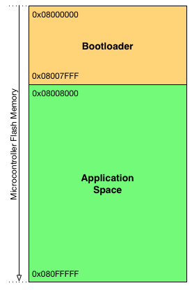

# STM32 Bootloader demo on 32L496GDISCOVERY
This example utilizes the 32L496GDISCOVERY discovery board from ST [[1]](#references), equipped with a STM32L496AG microcontroller [[2]](#references). This project demonstrates how to perform in-application-programming of a firmware located on external SD card with FAT32 file system.

Please refer to the main [README](../../README.md) for the complete description about the functionality and operation of the bootloader library.

## Table of Contents
- [Description](#description)
- [Operation](#operation)
- [Compile & Build](#compile--build)
- [References](#references)

## Description
This demo is implemented on the 32L496GDISCOVERY board from ST, equipped with a STM32L496AG microcontroller [[2]](#references). Please refer to the user manual of the discovery board for the complete schematics and board description [[3]](#references).

The microSD card is connected to the MCU over SDIO interface. The implementation uses the official HAL library of ST [[4]](#references) and can be compiled with IAR EWARM or GNU Arm Embedded Toolchain (ARM GCC). Programming and debugging are performed over the on-board ST-LINK debugger.

There are two LEDs located on the discovery board, which are easily accessible, and they don't require the use of the IO expander. These LEDs are used for signaling various status to the user and they are labeled as LD2 and LD3.

The middle (center) button of the blue joystick located on the discovery board is used for user interaction. This center button is simply referred as "button" in the following sections.

The UART2 interface of the MCU is connected directly to the ST-LINK on the board. When the ST-LINK is connected to the computer via USB, an additional virtual com port (USB VCP) is initialized by the debugger. The assigned COM port number can be checked in the Device Manager on Windows. This example project uses this virtual com port to output various debug messages. This functionality can be disabled or enabled with the `USE_VCP` definition located in the `main.h` file.

A compiled application image named `app-demo.bin` is provided with this example project. This file can be copied directly to the SD card of the discovery board and it can be used for testing the functionality of the bootloader. This small application does nothing but flashes the LD2 and LD3 LEDs repeatedly, in the following pattern:
1. LD2 blinks twice
2. LD3 blinks twice
3. LD2 and LD3 LEDs blink twice, simultaneously

The microcontroller flash is organized as follows: by default, the first 32kBytes (16 pages) of the flash is reserved for the bootloader and the rest of the flash is the application space.

*Figure 2: Flash organization*

## Operation
After power-up, the bootloader starts. The bootloader checks for user-interaction:

- If the button is not pressed, then the bootloader tries to launch the application: First it checks the application space. If there is a firmware located in the application space, the bootloader calculates the checksum over the application space and compares with the application checksum (if the checksum feature is enabled). Finally, the bootloader prepares for the jump by resetting the peripherals, disabling the SysTick, setting the vector table and stack pointer, then the bootloader performs a jump to the application.

- If the button is pressed and released within 4 seconds: LD2 is blinking during this interval and the bootloader tries to update the application firmware by performing the following sequence:

    1. Checks for write protection. If the application space is write-protected, then both LD2 and L3 LEDs are blinking for five seconds. If the button is pressed within this interval, the bootloader disables the write protection by re-programming the flash option bytes and performs a system reset (required after flash option bytes programming). Please note that after disabling the write protection, the user must invoke the application update procedure again by pressing the button in order to continue the firmware update.
    2. Initializes SD card, looks for application binary and opens the file.
    3. Checks the file size whether it fits the application space in the microcontroller flash.
    4. Initializes microcontroller flash.
    5. Erases the application space. During erase, the LD3 LED is on. If the user presses the button and keeps it pressed until the end of the flash erase procedure, the bootloader then interrupts the firmware update and does not perform flash programming after the erase operation. This feature is useful if the user only wants to erase the application space.
    6. Performs flash programming. During flashing the LD2 LED is blinking.
    7. Verifies flash programming by re-opening the firmware file located on the SD card and comparing the content of the file with the flash content.
    8. Enables write protection of application space if this feature is enabled in the configuration.
    9. After successful in-application-programming, the bootloader launches the application.

- If the button is pressed for more than 4 seconds: LD3 is blinking during this interval and the bootloader launches ST's built-in bootloader located in the internal boot ROM (system memory) of the chip. For more information, please refer to [[5]](#references). With this method, the bootloader can be updated or even a full chip re-programming can be performed easily, for instance by connecting the hardware to the computer via USB and using DFU mode [[6, 7]](#references).

- If the button is kept pressed for more than 9 seconds: the LEDs are switched off and the bootloader tries to launch the application located in the flash. This scenario is fully equivalent to the case when the user does not press the button after power-up (see above).

*Figure 3: Bootloader sequence*

## Compile & Build
The project can be built out-of-the-box with either IAR EWARM or GNU Arm Embedded Toolchain. The `EWARM` subfolder contains the required files to compile and build the demo with the IAR EWARM toolchain.

The `GCC` subfolder contains the compiler-specific files, a `Makefile` and a `SConscript` file to easily compile and build the project with the GNU Arm Embedded Toolchain.

### IAR EWARM
1. Open the `Project.eww` workspace file with IAR.
2. Build the project and download to the target.

Note: The IAR EWARM project is already configured with the required parameters and options in order to compile and build the demo with a single click.

### GNU Arm Embedded Toolchain
Prerequisites:
- GNU Arm Embedded Toolchain, recommended version: 8-2019-q3-update
- At least one of the followings:
    - GNU Make (for Windows, see: [Make for Windows](http://gnuwin32.sourceforge.net/packages/make.htm))
    - Python with pip

#### Build with Make
Steps to compile and build with GNU Make:

1. If the GNU Arm Embedded Toolchain has not been added to PATH: Edit the `CUSTOMPATH` variable in the `Makefile` so that it points to the `bin` folder of the installed GNU Arm Embedded Toolchain.
2. Open up your favorite terminal and navigate to the `GCC` subfolder where the makefile is located.
3. Type `make` and hit enter.
4. The `build` subfolder should contain the binary, ELF and HEX output files, named `stm32-bootloader.bin`, `stm32-bootloader.elf` and `stm32-bootloader.hex` respectively.

#### Build with SCons
This project currently supports two build configurations: debug (default) and release. Follow these steps to compile and build the project with SCons. Please note that the recommended usage is within a virtualenv.

1. Install the requirements: `pip install -r requirements.txt`
2. If the `bin` folder of the GNU Arm Embedded Toolchain does not exist in the PATH, it can be specified in the `SConstruct` file.
3. To build the project with the default debug configuration, execute: `scons -j8`
4. To build all build configurations at once, execute: `scons --all -j8`
5. To list all supported arguments, execute: `scons --help`
6. The `build` subfolder should contain the generated outputs, organized in subfolders with the names of the build configurations.

## References
[1] 32L496GDISCOVERY, https://www.st.com/en/evaluation-tools/32l496gdiscovery.html

[2] STM32L496AG, http://www.st.com/en/microcontrollers/stm32l496ag.html

[3] UM2160, "User manual, Discovery kit with STM32L496AG MCU", https://www.st.com/resource/en/user_manual/dm00353127.pdf

[4] UM1884, "Description of STM32L4 HAL and Low Layer drivers", http://www.st.com/resource/en/user_manual/dm00173145.pdf

[5] AN2606, "STM32 microcontroller system memory boot mode", http://www.st.com/resource/en/application_note/cd00167594.pdf

[6] AN3156, "USB DFU protocol used in the STM32 bootloader", http://www.st.com/resource/en/application_note/cd00264379.pdf

[7] UM0412, "Getting started with DfuSe USB device firmware upgrade", http://www.st.com/resource/en/user_manual/cd00155676.pdf

